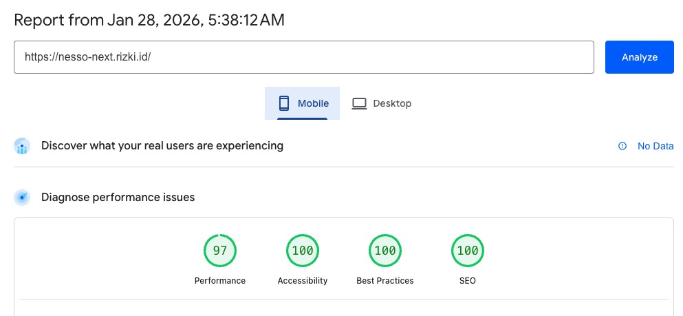

# Next.js Landing Page

You are in the `next-app` folder. This folder contains the project that showcases converting a Figma design into frontend code.

**Live demo page: [https://nesso-next.rizki.id](https://nesso-next.rizki.id)**

## Table of Contents

- [Pagespeed Insight Result](#pagespeed-insight-result)
- [Installation and Running Locally](#installation-and-running-locally)
- [Assumptions](#assumptions)
- [Development Approach](#development-approach)
  - [File Structure and Atomic Design](#file-structure-and-atomic-design)
  - [Technical Decision](#technical-decisions)
- [Performance, Accessibility, and SEO](#performance-accessibility-and-seo)
  - [Performance Strategy](#performance-strategy)
  - [Accessibility Strategy](#accessibility-strategy)
  - [SEO](#seo)
- [Responsiveness](#responsiveness)
- [Interactive Components](#interactive-components)
- [What I would do with more time](#what-i-would-do-with-more-time)

## Pagespeed Insight Result

Result: [https://pagespeed.web.dev/analysis/https-nesso-next-rizki-id/u32bj3sg2r?form_factor=desktop](https://pagespeed.web.dev/analysis/https-nesso-next-rizki-id/u32bj3sg2r?form_factor=desktop)

#### Desktop


#### Mobile



## Installation and Running Locally

### Prerequisites

- Node.js 20.9.0 or later
- npm

### Steps

1. Clone the repository

```bash
git clone https://github.com/anandarizki/nesso-assessment.git
cd nesso-assessment/next-app
```

2. Install dependencies (ensure you are in `next-app` folder)

```bash
npm install
```

3. Run the development server

```bash
npm run dev
```

4. Open the app in your browser

```
http://localhost:3000
```

## Assumptions

- I assume the assessment is intended to evaluate how closely the page can be implemented to match the original design. Therefore, even though I may personally disagree with some design decisions, I kept the implementation faithful to the provided design.
- The Figma design does not provide a small-screen layout, so the mobile version is based on my own judgment.
- The icon color defined in the Figma file for the “**Brands that work with us**” section is assumed to represent the hover state.
- The card with the arrow in the “**I nostri servizi**” section is assumed to indicate a hover interaction.

## Development Approach

### File Structure and Atomic Design

The approach is not only about splitting code by domain, but also by layer. Components are structured from the smallest to the largest, with a one-way dependency flow from small to big. Higher-level layers cannot be accessed by lower-level ones, which keeps dependencies clear and maintainable.

Components are split into the smallest units (`/components/ui`), then composed into base components (`/components/shared`), and finally into features (`/features/*`). This `features` will be use to build the pages. The smallest units and composed components do not contain logic, as they are purely presentational UI elements.

`Features` are independent of each other. Deleting any feature folder will not affect the other features. Below is a visualization of the layer relationships.


Below is an example of the file structure related to the **Portfolio section**.

```
src/
├── app/                           # NEXT.JS ROUTING (The "Where")
│   └── page.tsx                   # Homepage
│
├── components/                    # GLOBAL UI (The "Building Blocks")
│   ├── ui/                        # "Atoms": raw primitives
│   │   ├── button.tsx
│   └── shared/                    # "Molecules": Used across features
│       └── section-wrapper.tsx    # Combination of container and typography
│
├── features/                      # BUSINESS DOMAINS (The "Meat")
│   └── portfolio-section/
│       ├── components/            # "Organisms": Portfolio Section specific UI
│       │   └── showcase-slider.tsx
│       └── index.ts               # The Public API for this feature
│
└── utils/                         # PURE HELPERS
    └── cn.ts                      # Tailwind merge utility
```

> **Trade-offs** : For a simple project, this structure may feel overly complex. However, the benefits become more apparent as the project grows, providing better scalability, clearer boundaries, and easier long-term maintenance.

### Technical Decisions

#### Tailwind CSS for styling

Not a requirement, but based on the design, Tailwind felt like the most efficient choice. The layout is relatively generic, allowing me to move quickly while keeping styles consistent. Styling lives close to the markup, so there’s no need to jump between files. During implementation, some inconsistencies in font styles, spacing, and color usage in the design slowed things down slightly compared to usual.

> **Trade-offs** : Using Tailwind CSS can result in verbose HTML, both in .tsx files and when inspecting the markup in the browser. Additionally, when the design is inconsistent, it often requires creating custom utilities or hardcoded values, which can reduce clarity and reusability..

#### Theme Tokens

Theme tokens are defined as CSS variables in global.css. This approach ensures consistency across the application, enables faster styling iteration, and provides a single source of truth for colors and design values.

```css
:root {
  --background: #ffffff;
  --foreground-100: #f1f1f1;
  --foreground-200: #f6f6f6;
  --foreground-300: #8e8e8e;
  --foreground-400: #636363;
  --foreground: #434343;
  --foreground-900: #2f3042;
  --accent: #0b5ed7;
  --max: #000;
}
```

#### TypeScript over JavaScript

Type safety improves confidence, reduces mental overhead, and eliminates the need to memorize implicit data shapes.

#### kebab-case over camelCase

All file and folder names use kebab-case. This is a common convention in modern libraries and improves consistency. It also avoids case-sensitivity issues when working with Git across different operating systems.

#### Regular functions over arrow functions

Regular function declarations are the default style in many modern libraries, including Next.js. They are also hoisted, which can be beneficial in certain scenarios.

#### Compound Component Pattern over props drilling

```js
<Card>
  <CardTitle>Hello</CardTitle>
  <CardContent>This is card</CardContent>
</Card>

//instead of

<Card
  title="Hello"
  content="This is card"
/>
```

This approach is easier to read because it follows the natural structure of HTML. It is also more flexible: elements can be rearranged, additional components can be inserted, and interactive behavior can be added when needed. That said, this is not applied strictly—some components still use props where it makes more sense. The choice depends on the use case.

#### CVA for Maintainability and Scalability

Used for scalability and type safety, rather than relying on concatenated class strings. Compared to traditional approaches—such as messy template literals, complex ternary operators, or spaghetti if/else conditions—CVA is much easier to maintain. This becomes especially valuable when a component has multiple combined conditions, such as color, size, and variant.

```
<Button
  variant="fill"
  as="a" //Use <a> tag instead of <button>, all valid html tag is allowed
  theme="gray"
  size="icon"
>
  <IconComponent />
</Button>
```

## Performance, Accessibility, and SEO

### Performance Strategy

| Aspect                         | Implementation                                                                                                                                                                       |
| ------------------------------ | ------------------------------------------------------------------------------------------------------------------------------------------------------------------------------------ |
| **Fast Page Rendering**        | Server-side rendering (SSR) is prioritized to take full advantage of Next.js, improving initial load time and SEO.                                                                   |
| **Image & Asset Optimization** | Use `next/image`, define proper width and height attributes, prefer WebP for faster loading, and implement lazy loading.                                                             |
| **Font Rendering**             | Use next/font to enable proper font preloading and prevent FOUT (Flash of Unstyled Text) on initial load.                                                                            |
| **DOM Structure Complexity**   | Keep the HTML hierarchy as simple as possible and avoid excessive nesting.                                                                                                           |
| **Hydration Performance**      | Avoid unnecessary client-side hydration by limiting interactive components to where they are truly needed. Interactive components needed: Mobile Menu, Hero Section, Portfolio Slide |

### Accessibility Strategy

- **ARIA attributes** (such as aria-label and aria-controls) are added only when necessary. Not all elements require ARIA—native semantic HTML already provides accessibility information, and overusing ARIA can be redundant or even harmful to assistive technologies.
- **Single, clear `<h1>`**. There is a single primary heading that represents the page topic which in the Hero Section.
- **No skipped heading levels**. `h2` section title, `h3` for the title inside section, and `h4` for footer menu title.
- **Screen readers read content in a meaningful sequence** by ensuring logical DOM order matches visual order, such as in Hero Section where text content appears before decorative images in the DOM. CSS is used to rearrange layout, not DOM manipulation.
- **Keyboard navigation follows user expectations**, when user press `tab` keyboard, the link highlight so have correct sequence, from top to bottom.
- **No focus traps or unreachable elements** by ensuring no elements visually present but removed from the accessibility tree

### SEO Strategy

| Element           | Implementation                                                                                                                                                                                                                                                      |
| ----------------- | ------------------------------------------------------------------------------------------------------------------------------------------------------------------------------------------------------------------------------------------------------------------- |
| **Page Metadata** | Use proper `Metadata` attribute in `layout.tsx`. While many metadata attributes exist — such as `publisher`, `creator`, and `author` — for a landing page, the `title` and `description` tags are sufficient unless the page is intended for article-style content. |
| **Open Graph**    | Ensure the thumbnail image uses the correct size and dimensions. In this implementation, a 1200 × 630 image with a compressed file size is sufficient to ensure proper display across major social media platforms when shared.                                     |

Modern search engines are more advanced. They evaluate performance primarily based on the HTML structure, such as semantic markup, document hierarchy, and content order.

### Responsiveness

A **mobile-first approach** is applied. Responsiveness is handled not only by shrinking component sizes, but also by rearranging element positions without removing any content. This is managed entirely with CSS rather than conditional logic in React, resulting in cleaner code and better performance.

| Element                                   | Small Screen                                                                                                                         | Medium Screen                                              | Large Screen                                       |
| ----------------------------------------- | ------------------------------------------------------------------------------------------------------------------------------------ | ---------------------------------------------------------- | -------------------------------------------------- |
| **Header**                                | Keep logo, add hamburger menu and move navigation bar and contact cta to popup                                                       | Follow design with shrink navigation                       | Follow design                                      |
| **Footer**                                | 1 column                                                                                                                             | 3 columns                                                  | 3 columns                                          |
| **Hero Section**                          | Preserve element order, ensure no elements are cut off within the viewport, move the image downward, and prioritize the text and CTA | Follow the design with a scaled-down image                 | Follow the design                                  |
| **General Section Title and Description** | 1 column                                                                                                                             | 2 columns                                                  | 2 columns (follow the design)                      |
| **About Section**                         | 1 column                                                                                                                             | 2 columns                                                  | 2 columns (follow the design)                      |
| **Services Section**                      | 1 column                                                                                                                             | 2 columns                                                  | 2 columns (follow the design)                      |
| **About Section**                         | 1 column                                                                                                                             | 2 columns                                                  | 2 columns (follow the design)                      |
| **Portfolio Section**                     | 1 column, image on the top                                                                                                           | 2 columns, image on the right side                         | 2 columns (follow the design)                      |
| **Transformation Action Section**         | 1 column, image on the top                                                                                                           | 1 columns image on the top, 3 columns text below the image | 3 columns, image in the center (follow the design) |
| **Transformation Step Section**           | 1 column, 2 columns thumbnail (left image, right text)                                                                               | 3 columns shrink (follow the design)                       | 3 columns (follow the design)                      |
| **Collaboration Section**                 | 1 column                                                                                                                             | 1 column                                                   | 1 column (follow the design)                       |

## Interactive Components

- Mobile navigation
- Slider in the showcase section

## What I would do with more time

#### Scalability and Reusability

- Create **[Storybook](https://storybook.js.org/)** for component documentation and isolation, making components easier to scale and maintain in the future
- Add End-to-End (E2E) testing to ensure changes and refactors do not introduce regressions across critical user flows.

#### User Experience

- Add scroll-based animations to enhance visual engagement while keeping performance impact minimal.
- Provide an option to switch between dark and light modes to improve accessibility and user preference support.
- Refine the visual design in collaboration with a designer, as font sizes, spacing, and color usage are currently inconsistent across sections.

#### Error Handling

- Implement error handling and user feedback for image loading failures, such as fallback images or contextual messages.
- Provide static, non-interactive feedback for environments where JavaScript is unavailable or interactivity is not supported.

#### SEO

- Add structured data (Schema.org) to improve search engine understanding, including:
  - Organization schema
  - Professional Service schema
  - Website schema
  - Navigation / Sitelinks schema
  - Breadcrumb schema
  - Social profile and contact information schemas

#### CMS-Related Placeholders

- Add mocks and abstractions such as data-fetching services, internationalization (i18n), and content models.
- Prepare placeholders for CMS-driven features like dynamic pages, content collections, SEO fields, and media assets.
- Define clear data contracts and fallback content so the template is ready to integrate with a backend or CMS without structural changes.

> AI was used to help with minor vocabulary improvements while writing this README. All technical decisions and content are based on my own understanding and implementation of the project.
