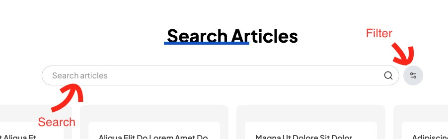
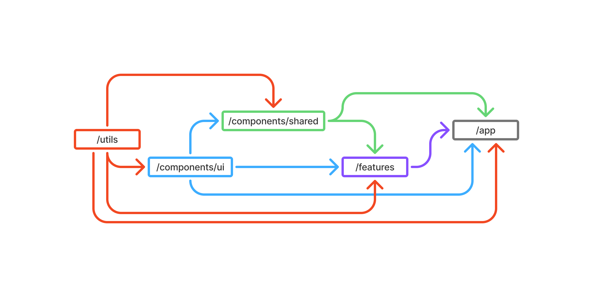

# A Simple React(Vite) Application

You are in the `vite-app` folder. This folder contains the project that showcases React / Vite client side mini app.

**Live demo page: [https://nesso-vite.rizki.id](https://nesso-vite.rizki.id)**

## ⛓️ About the App

This application simulates client-side searching, filtering, and sorting of articles. The main goal is to demonstrate practical patterns used in modern front-end development, including state management, component decomposition, codebase organization, unit testing, and clear separation between business logic and UI.

The project focuses on building realistic features that are commonly required in production applications, while keeping the implementation clean, predictable, and easy to maintain.


### How To Use

- Type keywords into the search input to perform a search
- Click the filter button to open the filter bar

### Features

- Real-time **search** as the user types
- **Filter** articles by category and predefined time range
- **Sort** articles by predefined criteria

### Constraints

- The data is statically imported, so it does not simulate data fetching or server-side interactions.
- The application focuses on functionality; therefore, the visual design is intentionally minimal.
- The article list is not paginated, as pagination is not a primary focus of this project.
- There is no functionality to open an article. The focus of this demo is on filtering and searching data.

## 💻 Installation & Running Locally

### Prerequisites

- Node.js 20.9.0 or later
- npm

### Steps

1. Clone the repository

```bash
git clone https://github.com/anandarizki/nesso-assessment.git
cd nesso-assessment/vite-app
```

2. Install dependencies (ensure you are in `vite-app` folder)

```bash
npm install
```

3. Run the development server

```bash
npm run dev
```

4. Open the app in your browser (port number may various)

```
http://localhost:5173
```

## 🛠️ Development Approach

### File Structure and Atomic Design

The approach is not only about splitting code by domain, but also by layer. Components are structured from the smallest to the largest, with a one-way dependency flow from small to big. Higher-level layers cannot be accessed by lower-level ones, which keeps dependencies clear and maintainable.

Components are split into the smallest units (`/components/ui`), then composed into base components (`/components/shared`), and finally into features (`/features/*`). This `features` will be use to build the pages. The smallest units and composed components do not contain logic, as they are purely presentational UI elements.

`Features` are independent of each other. Deleting any feature folder will not affect the other features. Below is a visualization of the layer relationships.


Below is a high-level overview of the project folder structure. Folder and file names are examples and may vary depending on the feature scope.

```

src/
├── pages/                          # Application routes / entry pages
│   ├── other-page/
│   ├── other-page/
│   └── article-page.tsx
│
├── components/                     # Global, feature-agnostic UI components
├── features/                       # Feature-based (domain-driven) modules
│   ├── other-feature/
│   ├── other-feature/
│   └── article/
│       ├── components/             # Article-specific UI components
│       │   ├── article-list.tsx
│       │   ├── search-article.tsx
│       │   └── index.ts
│       ├── hooks/                  # Reusable hooks scoped to the article domain
│       │   ├── use-filter-articles.ts
│       │   ├── use-filter-articles.test.ts
│       │   └── index.ts
│       ├── utils/                  # Article-related business logic helpers
│       │   ├── filter-article.ts
│       │   ├── filter-article.test.ts
│       │   └── index.ts
│       ├── types/                  # TypeScript types for the article domain
│       │   └── index.ts
│       └── index.ts                # Public API for the article feature
│
└── utils/                          # Global, framework-agnostic utilities
```

> Assumption: This application is treated as a new feature added to an existing landing page. Therefore, existing shared components are not included or shown in the folder structure above.

### Technical Decisions

#### Jotai for State Management

Jotai is used for its simplicity and flexibility. It provides a minimal API while still being powerful enough to handle all state management requirements in this demo application, without introducing unnecessary complexity.

> **Trade-offs** : Not suitable for complex application

#### TypeScript over JavaScript

Type safety improves confidence, reduces mental overhead, and eliminates the need to memorize implicit data shapes.

#### Vitest for Testing

Vitest is chosen because it is already part of the Vite ecosystem and aligns well with the project setup. It also reflects the tooling used in my day-to-day work, offering a familiar developer experience with fast execution and minimal configuration.

#### Tailwind for Styling

Tailwind CSS is used primarily because the components are reused from the Landing Page Assessment. Given that this project focuses on functionality rather than visual design, Tailwind provides a quick and consistent way to apply styling without additional overhead.

#### kebab-case over camelCase

All file and folder names use kebab-case. This is a common convention in modern libraries and improves consistency. It also avoids case-sensitivity issues when working with Git across different operating systems.

## ⚡ Search Debounce for Performance

To prevent unnecessary computations during typing, a debounce mechanism is applied to the search feature. This ensures that the search logic only runs after the user stops typing, improving performance and avoiding redundant state updates.

## 🧩 Unit Testing

For demonstration purposes, not every file includes unit tests. Testing is focused on the core business logic—specifically the article filtering functionality—where correctness matters most.

Test files follow the file-name.test.ts convention and are colocated with the implementation. This approach is preferred over a separate test directory because it is more practical, easier to maintain, and reduces context switching when navigating the codebase.

Most business logic lives in utilities and custom hooks, which makes them straightforward to test in isolation. UI components, by design, contain little to no logic and mainly focus on rendering, so they are intentionally kept out of the unit testing scope.

## ⏳ What I would do with more time

Add integration tests to validate interactions between filters, state management, and UI components, ensuring the overall behavior works correctly as a complete flow rather than in isolation.

> AI was used to help with minor vocabulary improvements while writing this README. All technical decisions and content are based on my own understanding and implementation of the project.
